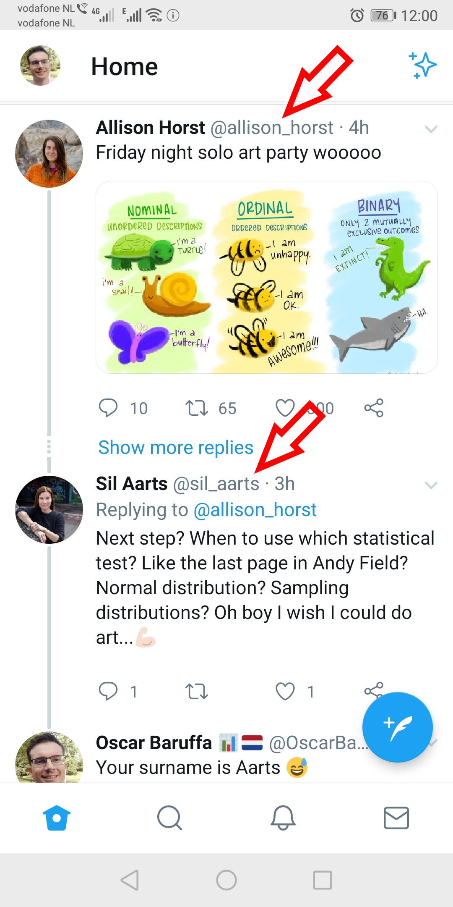

# Read the feed

So know you're following some folks. Let's look at your feed. 

<<feed gif>>

From time to time Twitter modifies the algorithms for what shows up in your feed, but here are the main things that causes a Tweet to enter it. 

Bear with us here!

1. Someone you follow posts a tweet.

* Someone you follow replies to a tweet. Often just their reply will show in your feed, but if a lot of people you follow reply to a tweet, the the orginal tweet also appaers with the thread of replies below it.

In the example below, Alison posted a tweet and Sil replied to it, and I follow both of them. 

    
* Someone you follow re-posts a tweet from someone else a.ka. posts a retweet a.k.a retweets. The retweet can either be with or without their own comment above it. 

Here you can see Zoe retweet this tweet (without commenting) from Programming Wisdom.

Here we see Bob retweeted a tweet by Malcolm, and commented on it. 

* Someone you follow likes someone else's tweet. That liked-tweet will be displayed in your feed. 
This tweet showed in my feed because Chelsea liked a tweet from Eli

* Posts from account that you don't follow but is followed by a lot of the people who you follow and that post is gettign a lot of interaction either from likes, retweets or comments.
<high engagement tweet>

* Advertisments. These have a little "promoted" tweet indicator. 

There's also two ways that you feed gets ordered. Either migically or chronologially.  
Some people have a preference, others don't. 

There's the "magic" way which is probably the default setting. 
This tries to prioritise posts that you might like, regardless of chronological order. 
If like me you prefer more chronological posts, turn this off like this.

<turn off magic timelines>>