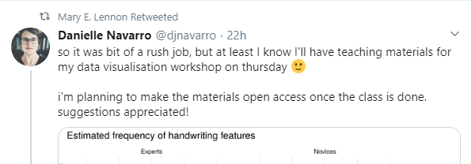
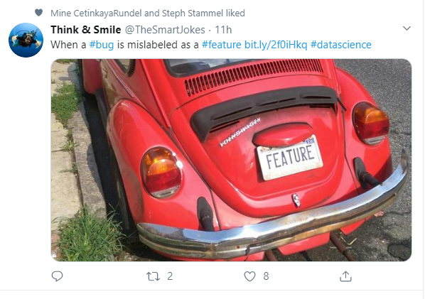

# Read the feed

So now you're following some folks. Let's look at your feed. 

<feed gif>

From time to time Twitter modifies the algorithms for what shows up in your feed. Here are the main ways your feed is populated. 

P.S. Bear with us here! 

## Someone you follow posts a tweet

This is the basic way your feed works. Someone you follow posts a tweet, it shows up in you feed. 
Here, Jesse posted a tweet of her and her cat and it showed in the feed. 

<blockquote class="twitter-tweet">
Jinx&#39;s new favorite thing is to crash my video calls. I&#39;m not even mad. <a href="https://t.co/kpjYVXUWDO">pic.twitter.com/kpjYVXUWDO</a>
&mdash; Jesse Mostipak (@kierisi) <a href="https://twitter.com/kierisi/status/1229274459649052672?ref_src=twsrc%5Etfw">February 17, 2020</a></blockquote> 

## Someone you follow replies to a tweet. 

A reply-tweet from someone you follow will show up in your feed. If you follow both the original poster of the tweet, you'll see the both the reply, and the orginal tweet being replied to. 

If a lot of people that you follow reply to a tweet, the the orginal tweet may appear with the thread of replies below it, even if you don't follow that orginal account that made the tweet.

In the example below, David posted a tweet and Nicole replied to it. 

<blockquote class="twitter-tweet">
I used to do this for my summer stats class but don&#39;t have any compelling artifacts
&mdash; Nicole Radziwill (@nicoleradziwill) <a href="https://twitter.com/nicoleradziwill/status/1229409187916062720?ref_src=twsrc%5Etfw">February 17, 2020</a></blockquote> 

## Retweets   

Someone you follow re-posts a tweet from someone else (also known as a retweet). The retweet can either be with or without their own comment above it. Both options are provided to you when you wish to retweet.

Here you can see Mary retweeted Danielle's tweet.
 

 

Here's an example of a quoted retweet. Josiah retweeted Tyler's tweet, and commented on it. 
<blockquote class="twitter-tweet">
This is seriously so mind boggling. <a href="https://t.co/ICZi5ji2xw">https://t.co/ICZi5ji2xw</a>
&mdash; Josiah 👨🏻
💻 (@JosiahParry) <a href="https://twitter.com/JosiahParry/status/1229480796106428416?ref_src=twsrc%5Etfw">February 17, 2020</a></blockquote> 

## Liked tweets

Someone you follow likes someone else's tweet. That liked-tweet will be displayed in your feed, even if you don't follow the account of the person whose tweet was liked. 

This tweet showed in the feed because Mine and Steph liked a tweet from Think&Smile.

## Promoted tweets
Advertisments. These have a little "promoted" tweet indicator at the bottom of the post. Anyone can pay to promote their tweets by paying money, but that's not necessary for you to be concerned with. It's possible to block these accounts just as you would with any other account if you don't like the advertiser. 

